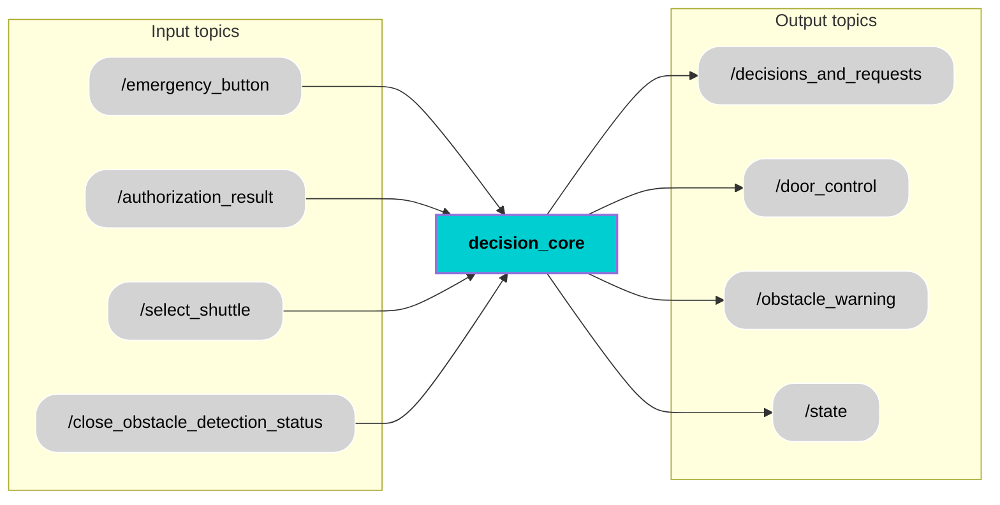

  <h1 style="font-size: 36px;">Decision Core</h1>

## 📚 Contents
- [Description](#-description)
- [Architecture](#-architecture)
- [Interfaces](#-interfaces)
- [User Stories ](#-user-stories)
- [Installation](#-installation)
- [Usage](#-usage)
- [Contributor](#-contributor)
- [License](#-license)

## 🧠 Description
The Decision Core is a central part of the autonomous shuttle system. It receives important input signals such as the emergency button status, authorization result, shuttle selection, and close obstacle detection. Based on this information, the Decision Core makes key decisions to control the shuttle’s behavior. It sends commands to open or close doors, gives obstacle warnings, updates the shuttle’s current state, and shares decision updates with other systems. By continuously checking all inputs and sending the right outputs, the Decision Core helps the shuttle run safely, respond quickly to changes, and follow the correct procedures.

## 🧩 Architecture

## 🔌 Interfaces

### Topics:
| Name                         | IO      | Type                 | Description                                                              |
|------------------------------|---------|----------------------|--------------------------------------------------------------------------|
| `/emergency_button`        | Input   | `std_msgs/msg/Bool.msg`      |  Indicates whether the emergency stop button has been pressed.              |
| `/authorization_result`         | Input   | `std_msgs/msg/Bool.msg`      | Shows if the shuttle has received permission to operate.                   |
| `/select_shuttle`        | Input   | `std_msgs/msg/Int8.msg`      |Specifies the ID of the shuttle selected for operation.                |
| `/close_obstacle_detection_status`         | Input   | `std_msgs/msg/Bool.msg`      | Signals whether a close-range obstacle has been detected near the shuttle. |
| `/decisions_and_requests`           | Output  | `std_msgs/msg/String.msg`      |Publishes high-level system commands and DENM messages for coordination.   |
| `/door_control`           | Output  | `std_msgs/msg/Bool.msg`      |  Controls the opening and closing of the shuttle doors.                   |
| `/obstacle_warning`           | Output  | `std_msgs/msg/Bool.msg`      |Issues a warning when a nearby obstacle is detected.                     |
| `/state`           | Output  | `std_msgs/msg/Int32.msg`      | 	Indicates the navigation goal: 0 = Pickup, 1 = Drop-off, 2 = Parking.|

### Custom messages:
No custom message.
### Interface test process:
Will be implemented in next Module

## 🎯 User Stories 
Will be implemented in next Module

## 🛠️ Installation
Will be implemented in next Module

## ▶️ Usage
Will be implemented in next Module

## 🧑‍💻 Contributor
[Everyone](https://git.hs-coburg.de/username)

## 🔒 License
Licensed under the **Apache 2.0 License**. See [LICENSE](LICENSE) for details.