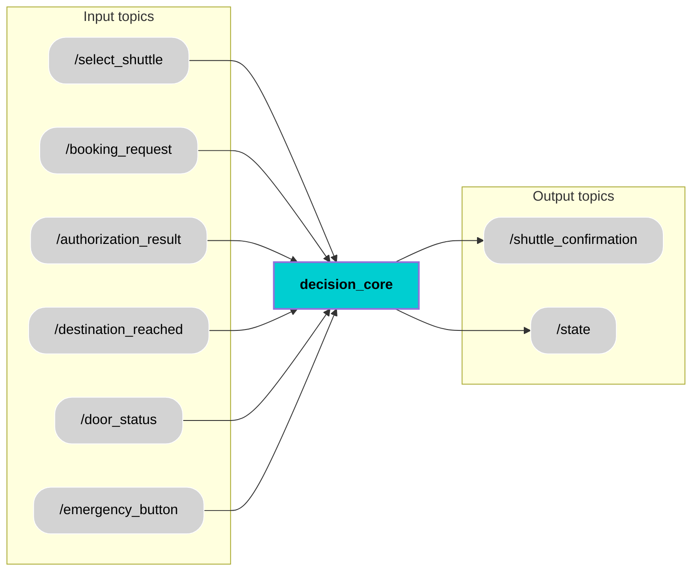

<div align="center">
  <h1 style="font-size: 36px;">Decision Core</h1>
</div>


## 📚 Contents
- [Description](#-description)
- [Architecture](#-architecture)
- [Interfaces](#-interfaces)
- [User Stories ](#-user-stories)
- [Installation](#-installation)
- [Usage](#-usage)
- [Contributor](#-contributor)
- [License](#-license)

## 🧠 Description
The Decision Core is responsible for managing the autonomous shuttle’s operational states using a Finite State Machine (FSM) powered by the transitions library. It handles transitions between key states like IDLE, DRIVING_AND_PLANNING, BOARDING, DROP_OFF_AND_DEBOARDING, and PARKING, ensuring smooth operation throughout the shuttle's journey. The system reacts to inputs from various sensors and modules to determine the shuttle’s current state and make necessary transitions.

The Decision Core transitions between different operational modes based on conditions like booking requests, destination reach, and door status. Using the transitions framework, each state transition is triggered by specific conditions (e.g., new booking request, emergency button press) and followed by actions which is different for each transition.The FSM ensures the shuttle operates reliably and consistently, enabling smooth transitions during boarding, drop-off, and emergency situations.


## 🧩 Architecture


## 🔌 Interfaces

### Topics:
| Name                         | IO      | Type                 | Description                                                              |
|------------------------------|---------|----------------------|--------------------------------------------------------------------------|
| `/select_shuttle`        | Input   | `std_msgs/msg/Int8.msg`      |  Provide the number of shuttle (e.g. which shuttle is selected for the ride).              |
| `/booking_request`         | Input   | `std_msgs/msg/Bool.msg`      | Provides a boolean indicating whether a booking request has been made.`(Booking received(True)and Booking not received(False)).`                 |
| `/authorization_result`           | Input  | `std_msgs/msg/Bool.msg`      |Provides a boolean indicating whether the user is `authorized(True) or not authorized(False).`  |
| `/destination_reached`        | Input   | `std_msgs/msg/Bool.msg`      |Provides a boolean indicating whether the shuttle has reached the destination. `(Destination reached(True) and not reached(False)).`|
| `/door_status`         | Input   | `std_msgs/msg/Bool.msg`      | Provides the status of the shuttle doors open(True) or close(False). |
| `/emergency_button`           | Input  | `std_msgs/msg/Bool.msg`      |Provides a boolean indicating whether the emergency button has been `pressed(True) or not(False).`    |
| `/shuttle_confirmation`           | Output  | `std_msgs/msg/Bool.msg`      | 	Publishes whether the shuttle is confirmed for a ride `(shuttle confirmed(True) and not confirmed(False)).`|
| `/state`           | Output  | `std_msgs/msg/Int32.msg`      | 	Provides the current state : `0 = IDLE , 1 = DRIVING AND PLANNING , 2 = BOARDING , DROPOFF AND DEBOARDING = 3 , PARKING = 4`|

### Custom messages:
No custom message.
### Interface test process:
Will be implemented in next Module

## State Transition Logic
| Trigger (Conditions)                         | From State           | To State                 | Action                                                              |
|------------------------------|-------------|----------------------|--------------------------------------------------------------------------|
| `/select_shuttle = 4` and `/booking_request = True`        | IDLE   | DRIVING AND PLANNING      |  1. Publish `/state = 1` (DRIVING AND PLANNING). <br> 2. Publish `/shuttle_confirmation = True` to server. <br>3. Keep DRIVING AND PLANNING state until booking_request becomes False from server. <br> 4. Once booking_request is False, publish /`shuttle_confirmation = False` to server.    |
| `/user_auhtorization = True`  and `/destination_reached = True`      | DRIVING AND PLANNING   | BOARDING     | 1. Publish `/state = 2` (BOARDING).   <br>    2. Monitor door status to detect when the door first opened and then closed.          |
| `/door_status = True` and then `/door_status = False`          | BOARDING  | DRIVING AND PLANNING      |1. Publish `/state = 1` (DRIVING AND PLANNING).  |
| `/destination_reached = True`        | DRIVING AND PLANNING   | DROPOFF AND DEBOARDING      |1. Publish `/state = 3` (DROPOFF AND DEBOARDING).<br> 2. Monitor door status to detect when the door first opened and then closed.  |
| `/emergency_button = True`         | DRIVING AND PLANNING   | DROPOFF AND DEBOARDING      | 1. Publish `/state = 3` (DROPOFF AND DEBOARDING).<br> 2. Monitor door status to detect when the door first opened and then closed.|
| `/door_status = True and then /door_status = False` and `/booking_request = False`           | DROPOFF AND DEBOARDING  | PARKING      | 1. Publish `/state = 4` (PARKING)    |
| `/booking_request = True`           | DROPOFF AND DEBOARDING  | DRIVING AND PLANNING      | 	1. Publish `/state = 1` (DRIVING AND PLANNING). <br> 2. Publish `/shuttle_confirmation = True` to server. <br>3. Keep DRIVING AND PLANNING state until booking_request becomes False from server. <br> 4. Once booking_request is False, publish /`shuttle_confirmation = False` to server.   |
| `/destination_reached = True` and `/booking_request = False`           | PARKING  | IDLE        | 	1. Publish `/state = 0` (IDLE).|
| `/booking_request = True`           | PARKING  | DRIVING AND PLANNING        | 	1. Publish `/state = 1` (DRIVING AND PLANNING). <br> 2. Publish `/shuttle_confirmation = True` to server. <br>3. Keep DRIVING AND PLANNING state until booking_request becomes False from server. <br> 4. Once booking_request is False, publish /`shuttle_confirmation = False` to server.  |

## 🎯 User Stories 
[US 2.3] (https://miro.com/app/board/uXjVI9mh4O0=/?moveToWidget=3458764647163753676&cot=14): State transion from IDLE to DRIVING AND PLANNING
[US 3.19] (https://miro.com/app/board/uXjVI9mh4O0=/?moveToWidget=3458764647165097962&cot=14) : State transion from DRIVING AND PLANNING to BOARDING
[US 5.1] (https://miro.com/app/board/uXjVI9mh4O0=/?moveToWidget=3458764647166347143&cot=14) : State transion from BOARDING to DRIVING AND PLANNING
[US 3.20] (https://miro.com/app/board/uXjVI9mh4O0=/?moveToWidget=3458764647166887321&cot=14) : State transion from DRIVING AND PLANNING to DROPOFF AND DEBOARDING
[US 7.1] (https://miro.com/app/board/uXjVI9mh4O0=/?moveToWidget=3458764647167520276&cot=14) : State transion from DROPOFF AND DEBOARDING to PARKING
[US 8.1] (https://miro.com/app/board/uXjVI9mh4O0=/?moveToWidget=3458764647168209098&cot=14): State transion from PARKING to IDLE
[US 7.2] (https://miro.com/app/board/uXjVI9mh4O0=/?moveToWidget=3458764647172377638&cot=14) : State transion from DROPOFF AND DEBOARDING to DRIVING AND PLANNING(New booking received)
[US 8.2] (https://miro.com/app/board/uXjVI9mh4O0=/?moveToWidget=3458764647172805030&cot=14) : State transion from PARKING to DRIVING AND PLANNING(New booking received)

## 🛠️ Installation
First, open terminal and install transitions framework and Streamlit(for real-time state visualization).
```bash
pip install transitions
pip install streamlit
```
1. Create workspace, src and go to src
```bash
mkdir temp_ws
cd temp_ws
mkdir src
cd src
```
2. Clone component repository
```bash
git https://git.hs-coburg.de/pax_auto/decision_core.git
```
5. Return to workspace and build the package
```bash
cd ..
colcon build --packages-select decision_core
```
6. Source the setup files
```bash
source install/setup.bash
```


## ▶️ Usage
1.Run the node:
```bash
ros2 run decision_core decision_core
```
2.For real-time state visulization : <br>
2.1 : Open the fsm_viewer.py file in your editor. <br>
2.2 : Locate the line where the fsm_live.png image is being referenced. <br>
2.3 : Replace that line with the correct path to the image in your workspace. `e.g.(image_path = r"/home/harsh/temp_ws/fsm_live.png")`

```bash
cd src/decision_core/decision_core/
python3 streamlit run fsm_viewer.py
```


## 🧑‍💻 Contributor
[Harsh Mukeshbhai Bhadani](https://git.hs-coburg.de/harshbhadani) 

## 🔒 License
Licensed under the **Apache 2.0 License**. See [LICENSE](LICENSE) for details.