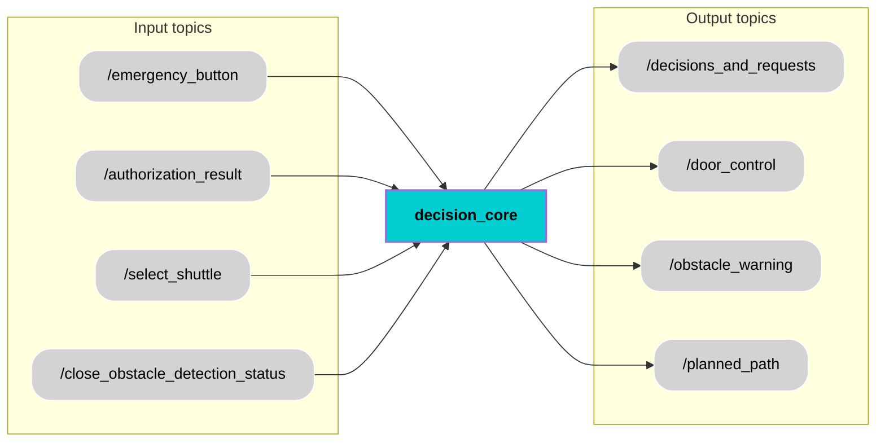

<div align="center">
  <h1 style="font-size: 36px;">Decision Core</h1>
</div>


## 📚 Contents
- [Description](#-description)
- [Architecture](#-architecture)
- [Interfaces](#-interfaces)
- [User Stories & Acceptance Criteria](#-user-stories--acceptance-criteria)
- [Installation](#-installation)
- [Usage](#-usage)
- [Contributor](#-contributor)
- [License](#-license)

## 🧠 Description
The Decision Core is a key component of the autonomous shuttle system. It is responsible for interpreting system-level inputs and making essential operational decisions to ensure safe and coordinated shuttle behavior. It receives inputs such as the emergency stop signal, authorization status, shuttle selection command, and close obstacle detection status. These inputs reflect both user commands and real-time environmental conditions.
Based on this data, the Decision Core generates key outputs that affect the shuttle’s behavior. It sends high-level commands to  V2X communication via the decisions and requests topic, often in the form of DENM (Decentralized Environmental Notification Messages) such as broadcasting warnings or alerts about dangerous situations or events on the road. It also controls the door mechanism, triggers obstacle warnings when necessary, and broadcasts the current operational state of the shuttle. By continuously monitoring these inputs and updating its outputs accordingly, the Decision Core ensures that the shuttle operates safely, reacts promptly to emergencies, and follows authorized procedures under dynamic conditions.


## 🧩 Architecture


## 🔌 Interfaces

### Topics:
| Name                         | IO      | Type                 | Description                                                              |
|------------------------------|---------|----------------------|--------------------------------------------------------------------------|
| `/emergency_button`        | Input   | `std_msgs/Bool`      |  Indicates whether the emergency stop button has been pressed.              |
| `/authorization_result`         | Input   | `std_msgs/Bool`      | Shows if the shuttle has received permission to operate.                   |
| `/select_shuttle`        | Input   | `std_msgs/Int8.msg`      |Specifies the ID of the shuttle selected for operation.                |
| `/close_obstacle_detection_status`         | Input   | `std_msgs/Bool`      | Signals whether a close-range obstacle has been detected near the shuttle. |
| `/decisions_and_requests`           | Output  | `std_msgs/String`      |Publishes high-level system commands and DENM messages for coordination.   |
| `/door_control`           | Output  | `std_msgs/Bool`      |  Controls the opening and closing of the shuttle doors.                   |
| `/obstacle_warning`           | Output  | `std_msgs/Bool`      |Issues a warning when a nearby obstacle is detected.                     |
| `/planned_path`           | Output  | `nav_msgs/Path.msg`      |Provides the computed navigation path from the shuttle’s current position to the target location.|

### Custom messages:
No custom message.
### Interface test process:
Write steps to test the interface

## 🎯 User Stories & Acceptance Criteria
### Heading
**User Story x.x**  
_xx_
 
**Acceptance Criteria**  
- **x.x.1** xx  
- **x.x.2** xx  

## 🛠️ Installation
```bash
git clone xx.git
```

## ▶️ Usage
Run the node:
```bash
ros2 run xx xx
```

## 🧑‍💻 Contributor
[Name](https://git.hs-coburg.de/username)

## 🔒 License
Licensed under the **Apache 2.0 License**. See [LICENSE](LICENSE) for details.

