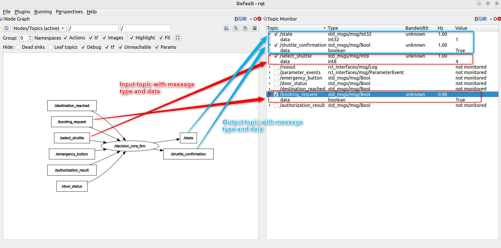
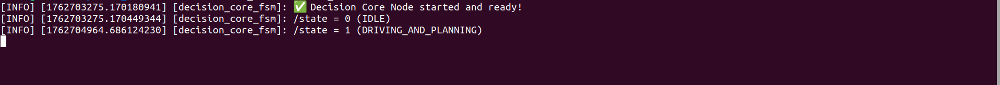
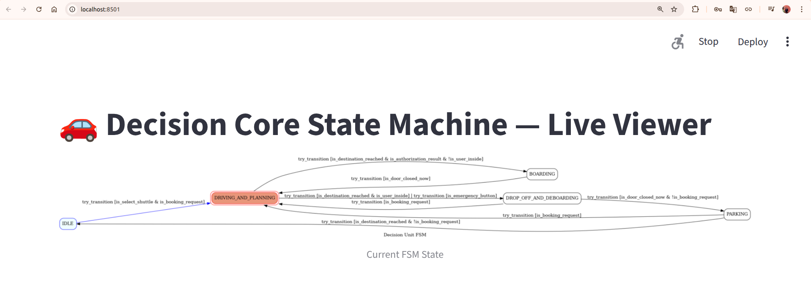

# Procedure to do interface test(Only for one transition IDLE to DRIVING AND PLANNING)
1. Follow the installation and usage procedure from component repository to launch the ROS2 package
2. Execute the command for feeding input in new terminal
    ```bash
    source install/setup.bash
    ros2 topic pub /select_shuttle std_msgs/msg/Int8 "data: 4" 
    ```
3. Execute the command for feeding input in new terminal
    ```bash
    source install/setup.bash
    ros2 topic pub /booking_request std_msgs/msg/Bool "data: true" 
    ```
4. Open RQT in new terminal
    ```bash
    source install/setup.bash
    rqt
    ```
5. Configure RQT

    Plugins -> Introspection -> Node Graph

    Plugins -> Topics -> Topic Monitor

6. Output in rqt should look like this: 
    
    

7. Output in terminal where decision_core node started should look like this:

        

8. Real-time state visulization on the web browser should look like this:
 
    
 


